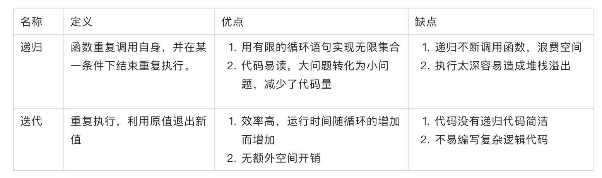

## 递归

递归：程序重复调用自身，并明确有递归结束条件的编程称为递归。

使用要满足以下两个条件：

* 在过程或函数内调用自身；
* 必须有一个明确的递归结束条件；
  
## 迭代

迭代：迭代是重复反馈过程的活动。每一次对过程的重复称为一次“迭代”，每一次迭代得到的结果会作为下一次迭代的初始值。如下简单例子

## 两者区别与关系

* 区别

* 关系

1. 递归中有迭代，但迭代中不一定有递归，大部分可以相互转换；
2. 相比较而言，能用迭代就不要用递归，递归不断调用函数，浪费空间，也容易引起堆栈溢出；
