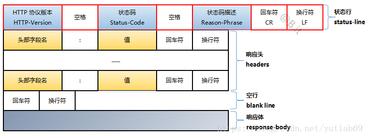

# Week 08

## 浏览器渲染流程

* 第一步是处理HTML标签并构造DOM树。
  
  当解析器发现非阻塞资源，例如一张图片，浏览器会请求这些资源并且继续解析。当遇到一个CSS文件时，解析也可以继续进行，但是对于 script 标签（特别是没有 async 或者 defer 属性）会阻塞渲染并停止HTML的解析。

* 第二步是处理CSS并构建CSSOM树。  

  CSSOM和DOM是相似的。DOM和CSSOM是两棵树. 它们是独立的数据结构。浏览器将CSS规则转换为可以理解和使用的样式映射。浏览器遍历CSS中的每个规则集，根据CSS选择器创建具有父、子和兄弟关系的节点树。

* 第三步是将DOM和CSSOM组合成一个Render树，计算样式树或渲染树从DOM树的根开始构建，遍历每个可见节点。

  像 head 标签和它的子节点以及任何具有display: none样式的结点，例如script { display: none; }（在user agent stylesheets可以看到这个样式）这些标签将不会显示，也就是它们不会出现在Render树上。具有visibility: hidden的节点会出现在Render树上，因为它们会占用空间。  

  Render树保存所有具有内容和计算样式的可见节点——将所有相关样式匹配到DOM树中的每个可见节点，并根据CSS级联确定每个节点的计算样式。

* 第四步是在渲染树上运行布局以计算每个节点的几何体。  
  布局是确定呈现树中所有节点的宽度、高度和位置，以及确定页面上每个对象的大小和位置的过程。回流是对页面的任何部分或整个文档的任何后续大小和位置的确定。  

  构建渲染树后，开始布局。渲染树标识显示哪些节点（即使不可见）及其计算样式，但不标识每个节点的尺寸或位置。为了确定每个对象的确切大小和位置，浏览器从渲染树的根开始遍历它。  

  第一次确定节点的大小和位置称为布局。随后对节点大小和位置的重新计算称为回流。

* 最后一步是将各个节点绘制到屏幕上
  
  当页面中元素样式的改变并不影响它在文档流中的位置时（例如：color、background-color、visibility等），浏览器会将新样式赋予给元素并重新绘制它，这个过程称为重绘。

## 状态机

有限状态自动机（英语：finite-state automation，缩写：FSA），简称状态机，是表示有限个状态以及在这些状态之间的转移和动作等行为的数学计算模型。  

* 利用状态机解析 http 协议

## HTTP协议

HTTP属于应用层协议，建立在 tcp 之上。HTTP的这两种报文都由三部分组成：开始行、首部行、实体主体。

* 请求报文

  一个HTTP请求报文由请求行（request line）、请求头（headers）、空行和请求体4个部分组成，下图给出了请求报文的一般格式。

  
  0
* 响应报文
  
  一个HTTP请求报文由状态行行（request line）、响应头（headers）、空行和响应体4个部分组成，下图给出了请求报文的一般格式。
  
  

## 作业

* [服务端代码](./toy-browser/server.js)
* [客户端代码](./toy-browser/client.js)
