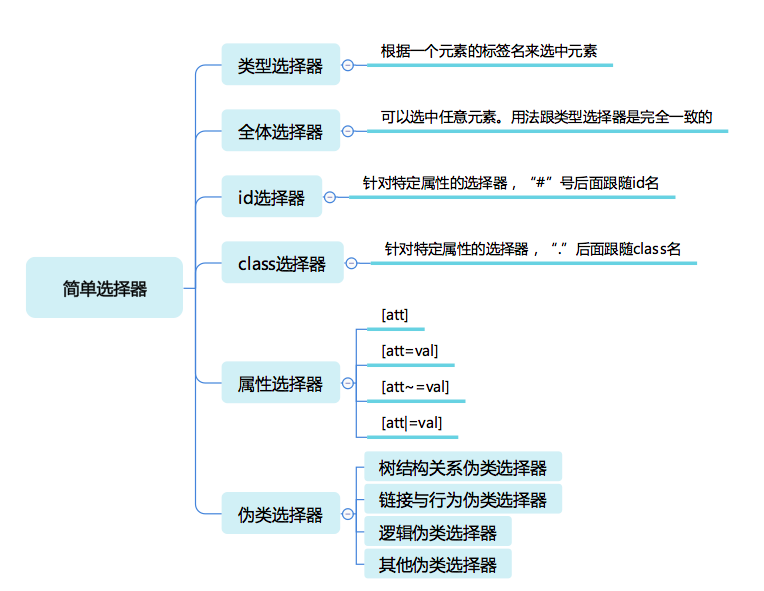

# Week 11

## CSS 选择器

## 问答题

* 为什么 first-letter 可以设置 float 之类的，而 first-line 不行呢

first-letter 一开始就可以确定，而 first-line 得等到布局(layout)完成即计算出每个节点的位置之后才能确定，而确定之后又可以给 first-line 设置的 float 等会引起重排的属性的话又会进入新一轮的 layout 计算，而计算之后 first-line 又可能会有变化，陷入死循环。