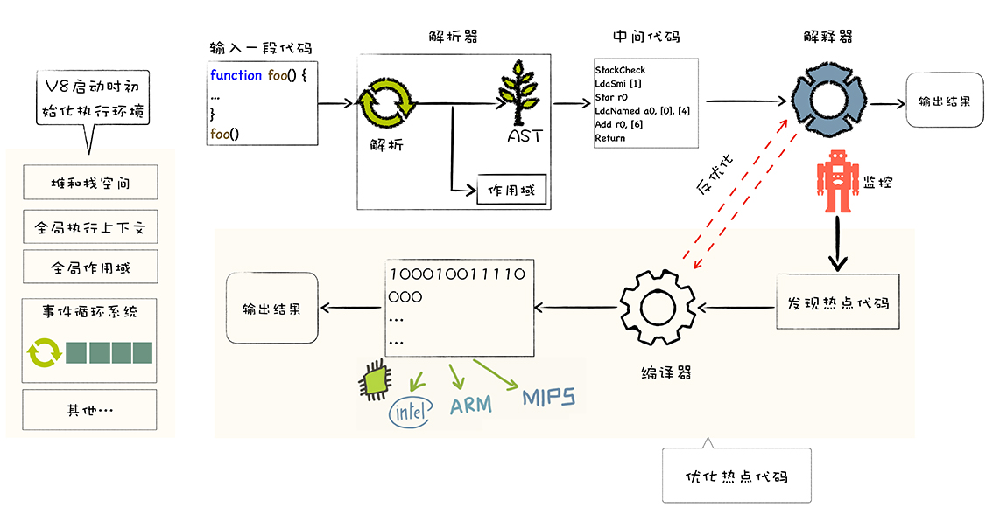

# V8执行一段 js 代码的流程

## 什么是V8

V8 是一个由 Google 开发的开源 JavaScript 引擎，目前用在 Chrome 浏览器和 Node.js 中，其核心功能是执行的 JavaScript 代码。JS代码无法被计算机直接执行，计算机所能执行的是机器指令（二进制指令），而 V8 的主要工作就是解析并执行 JS 代码。

## V8执行JS代码的流程

1. 初始化基础环境；
2. 解析源码生成 AST 和作用域；
3. 依据 AST 和作用域生成字节码；
4. 解释执行字节码；
5. 监听热点代码;
6. 优化热点代码为二进制的机器代码；
7. 反优化生成的二进制机器代码。

### 初始化基础环境

准备执行 JavaScript 时所需要的一些基础环境，这些基础环境包括了“堆空间”“栈空间”“全局执行上下文”“全局作用域”“事件循环系统”“内置函数”等。

* JavaScript 全局执行上下文就包含了执行过程中的全局信息，比如一些内置函数，全局变量等信息；
* 全局作用域包含了一些全局变量，在执行过程中的数据都需要存放在内存中；
* 而 V8 是采用了经典的堆和栈的内存管理模式，所以 V8 还需要初始化内存中的堆和栈结构；
* 另外，想要我们的 V8 系统活起来，还需要初始化事件循环系统，事件循环系统包含了事件驱动器和事件队列，它如同 V8 的心脏，不断接受事件并决策如何处理事件。

### 解析源码生成 AST 和作用域

V8 会接收到要执行的 JavaScript 源代码，不过这对 V8 来说只是一堆字符串，V8 并不能直接理解这段字符串的含义，它需要结构化这段字符串。结构化，是指信息经过分析后可分解成多个互相关联的组成部分，各组成部分间有明确的层次结构，方便使用和维护，并有一定的操作规范。  

V8 源代码的结构化之后，就生成了抽象语法树 (AST)，我们称为 AST，AST 是便于 V8 理解的结构。  

这里还需要注意一点，在生成 AST 的同时，V8 还会生成相关的作用域，作用域中存放相关变量。

### 依据 AST 和作用域生成字节码

有了 AST 和作用域之后，接下来就可以生成字节码了，字节码是介于 AST 和机器代码的中间代码。但是与特定类型的机器代码无关，解释器可以直接解释执行字节码，或者通过编译器将其编译为二进制的机器代码再执行。

### 解释执行字节码

生成了字节码之后，解释器会按照顺序解释执行字节码，并输出执行结果。

### 监听热点代码

监控解释器执行状态模块在解释执行字节码过程中，如果发现某段代码被重复多次执行，那么会监控模块将这段代码标记为热点代码。

### 优化热点代码为二进制的机器代码

一段代码被标记为热点代码后，其字节码会被优化编译器编译为二进制代码，然后对编译后的二进制代码执行优化操作，优化后的二进制机器代码的执行效率会大幅提升。如果下面再次执行这段热点代码，V8 会优先选择优化之后的二进制代码进行执行。

### 反优化生成的二进制机器代码

JavaScript 是一种非常灵活的动态语言，对象的结构和属性是可以在运行时任意修改的，而经过优化编译器优化过的代码只能针对某种固定的结构，一旦在执行过程中，对象的结构被动态修改了，那么优化之后的代码势必会变成无效的代码，这时候优化编译器就需要执行反优化操作，经过反优化的代码，下次执行时就会回退到解释器解释执行。
